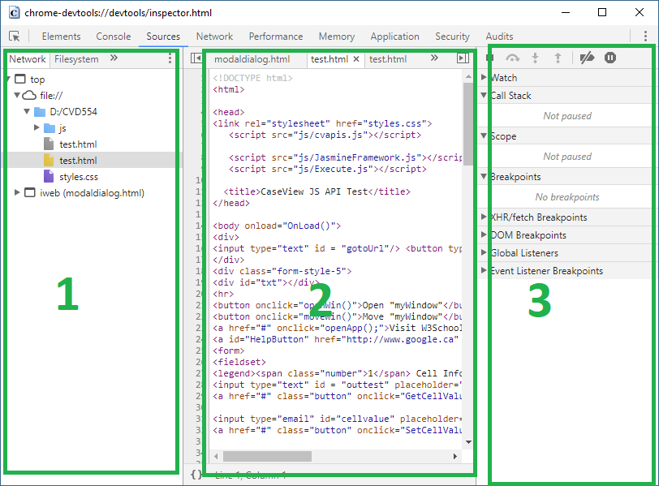

# How to use CaseView APIs in CEF Dialog

The CEF Dialog has been improved and supports most CaseView APIs and objects in WP2018 update 1. You can use CaseView APIs in HTML and JavaScript when you launch the CEF Dialog by the runHTMLDialogCef() API.


## Lanuch CEF Dialog

In CaseView, using Application. runHTMLDialogCef API to launch CEF Dialog to show the HTML file.


### Syntax


```javascript
runHTMLDialogCef (sHTMLFileName, Flags, isModal, [dialogParam])
```


### Parameters

**sHTMLFileName** is the URL or file name of a HTML file.

**Flags** has two values 0 and 1. 1 means that the dialog is resizable.

**isModal's** type is bool. TRUE means that the dialog is modal dialog. FALSE means it is modeless dialog.

**dialogParam** is optional, and it is a string of JavaScript that can be passed into the HTML file.


### Return Value

This API returns string value.


### Remarks

All the CaseView APIs and Objects only can be accessed in a modal CEF dialog. It means that the **isModal **must be set TRUE when calling this API.


### Example


```javascript
function LaunchCEFDialog() {
    // the HTML file's name
    var src = "file:///D:/test.html";
    //calling API
    Application.runHTMLDialogCef(src, 0, true);
}
```


## Debugging JavaScript in CEF Dialog

Debugging in CEF Dialog is totally different from ActiveScript or JsRT. You should use DevTools to debug the JavaScript.


### Turn on the DevTools

To turn on or turn off the DevTools, setting the **EnableCefDevTools** to 1 or 0 in CV.VER, by default the DevTools is hidden.


### Using DevTools to debug

Right click in the CEF Dialog and select Show DevTools on the context menu to open the DevTools.


Click the Sources tab to show the source codes.


The Sources panel UI has 3 parts.





1.  The **File Navigator** pane. Every file that the page requests is listed here.
1.  The **Code Editor** pane. After selecting a file in the **File Navigator pane**, the contents of that file are displayed here.
1.  The **JavaScript Debugging** pane. Various tools for inspecting the page's JavaScript.


Set a breakpoint.

In **Code Editor** Pane, clicking the line number to set a breakpoint in the JavaScript source code. 

**Note: The debugger keyword works only when the DevTools opened**.


You need to reload HTML file when you open the DevTools for showing the source codes.


## The undefined method or property

If you encounter the undefined error when you call a method or property of a CV object, you should ensure that the name of the method or property is correct. You could use DevTools to check the name by following steps.


1.  Open the DevTools.
1.  Set a breakpoint on the line that calls the method of property.
1.  Active the breakpoint and move the mouse cursors to the CV object which includes the method or property.
1.  The detail window of the object will show up, the comparing the name and find the correct name.


## Date type in CEF Dialog

In CEF dialog, it doesn't support Date.getVarDate() method, since getVarDate() is supported in Internet Explorer only. You should use the JavaScript Date object instead of getVarDate().

Let's see the following sample code.


```javascript
function SetCellDateVale()
{
     //First, get cell
    var cell = Application.Document().cell("C1"); 
   //set cell type to date type
   cell.type = 2;
   //set cell value
   cell.value = new Date('1/01/2019'); //Create Date object
}
```


## VBArray object in CEF Dialog

In CEF Dialog, the **VBArray** is not supported and you don't even have to use **VBArray**. The return type of a CaseView API which returns an Array is a JavaScript array type now. You could directly use the result as an array.

For instance: The API Document.paraIndicesByCell.


```javascript
function paraIndices(){
    //Get the Index List
    //the return type of paraIndicesByCell is JavaScript array.
    var oParaIndexList = Document.paraIndicesByCell(sCellName);
    //iterate the array.
    for(i = 0; i < oParaIndexList.Length; i++)
    	console.log(oParaIndexList[i]);
}
```


## ActiveXObject in CEF Dialog

The ActiveX object has been deprecated in CEF Dialog, but you could use Application.addActiveXObj API to add a WP ActiveX object into HTML.

** **


## The important you need to be aware


*   **The JavaScript in CEF Dialog is case-sensitive and all the CV APIs (without argument) must be ended with parentheses ().**
*   **Some CV APIS, like doc.MessageBox that can pop up a window, will block the script, which means that the JavaScript will stop running and wait for the response. This will cause the CV API execution timeout if there is no response for a long time (more than 500 seconds).  Avoid using this kind of APIs and try to use HTML code instead. You could use JavaScript alert or confirm to instead of MessageBox, or using HTML and CSS to create a message box.**

<!-- GD2md-html version 1.0β11 -->
